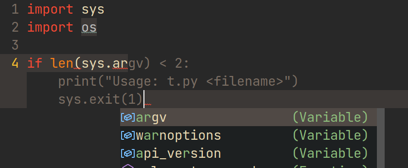
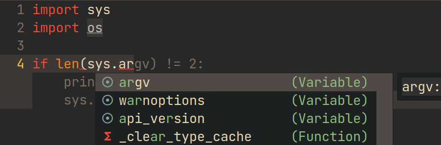

[](https://jcs-emacs.github.io/jcs-elpa/#/copilot)
[](http://melpa.org/#/copilot)
[](http://stable.melpa.org/#/copilot)

# Copilot.el

Copilot.el is an Emacs plugin for GitHub Copilot.


This plugin is unofficial, however it makes use of the official [@github/copilot-language-server][] provided by Microsoft.

> [!NOTE]
>
> You need access to [GitHub Copilot][] to use this plugin. The service introduced a free layer in early 2025.

## Requirements

`copilot.el` requires Emacs 27+.

[@github/copilot-language-server][] requires Node.js 22+.

## Installation

1. Setup `copilot.el` as described in the next section.

2. Install the copilot server by `M-x copilot-install-server`.

3. Login to Copilot by `M-x copilot-login`. You can also check the status by running `M-x copilot-diagnose` (`NotAuthorized` means you don't have a valid subscription).

4. Enjoy!

## Configurations

### Example for Doom Emacs

<details>

Add package definition to `~/.doom.d/packages.el`:

```elisp
(package! copilot
  :recipe (:host github :repo "copilot-emacs/copilot.el" :files ("*.el")))
```

Configure copilot in `~/.doom.d/config.el`:

```elisp
;; accept completion from copilot and fallback to company
(use-package! copilot
  :hook (prog-mode . copilot-mode)
  :bind (:map copilot-completion-map
              ("<tab>" . 'copilot-accept-completion)
              ("TAB" . 'copilot-accept-completion)
              ("C-TAB" . 'copilot-accept-completion-by-word)
              ("C-<tab>" . 'copilot-accept-completion-by-word)))
```

Strongly recommend to enable `childframe` option in `company` module (`(company +childframe)`) to prevent overlay conflict.

If pressing tab to complete sometimes doesn't work you might want to bind completion to another key or try:

```elisp
(after! (evil copilot)
  ;; Define the custom function that either accepts the completion or does the default behavior
  (defun my/copilot-tab-or-default ()
    (interactive)
    (if (and (bound-and-true-p copilot-mode)
             ;; Add any other conditions to check for active copilot suggestions if necessary
             )
        (copilot-accept-completion)
      (evil-insert 1))) ; Default action to insert a tab. Adjust as needed.

  ;; Bind the custom function to <tab> in Evil's insert state
  (evil-define-key 'insert 'global (kbd "<tab>") 'my/copilot-tab-or-default))
```

If you would love to configure indentation here, this is an example config that may work for you:

```elisp
(use-package! copilot
  :hook (prog-mode . copilot-mode)
  :bind (:map copilot-completion-map
              ("<tab>" . 'copilot-accept-completion)
              ("TAB" . 'copilot-accept-completion)
              ("C-TAB" . 'copilot-accept-completion-by-word)
              ("C-<tab>" . 'copilot-accept-completion-by-word)
              ("C-n" . 'copilot-next-completion)
              ("C-p" . 'copilot-previous-completion))

  :config
  (add-to-list 'copilot-indentation-alist '(prog-mode 2))
  (add-to-list 'copilot-indentation-alist '(org-mode 2))
  (add-to-list 'copilot-indentation-alist '(text-mode 2))
  (add-to-list 'copilot-indentation-alist '(closure-mode 2))
  (add-to-list 'copilot-indentation-alist '(emacs-lisp-mode 2)))
```

</details>

### Example for Spacemacs

<details>

Edit your `~/.spacemacs` to include the GitHub Copilot layer this will setup everything for you:

```elisp
;; ===================
;; dotspacemacs/layers
;; ===================

;; add or uncomment the auto-completion layer
;; add the GitHub Copilot layer
dotspacemacs-configuration-layers
'(
  ...
  auto-completion
  github-copilot
  ...
 )
```
For details about the default bindings please refer to the Spacemacs documentation for the
github-copilot layer.

</details>

### General Configurations

<details>

#### 1. Load `copilot.el`

##### Option 1: Load via use-package (recommended)

###### Emacs 27-29:

`straight.el`:

```elisp
(use-package copilot
  :straight (:host github :repo "copilot-emacs/copilot.el" :files ("*.el"))
  :ensure t)
```

`quelpa` + `quelpa-use-package`:

```elisp
(use-package copilot
  :quelpa (copilot :fetcher github
                   :repo "copilot-emacs/copilot.el"
                   :branch "main"
                   :files ("*.el")))
```

###### On Emacs version 30+:

```elisp
(use-package copilot
  :vc (:url "https://github.com/copilot-emacs/copilot.el"
            :rev :newest
            :branch "main"))
```

Use `:map`, `:hook`, and `:config` to customize `copilot.el` via `use-package`.

##### Option 3: Load manually

Please make sure you have these dependencies installed (available in ELPA/MELPA):

- `editorconfig`
- `f`

After installing those, clone this repository then insert the below snippet into your config file.

```elisp
(add-to-list 'load-path "/path/to/copilot.el")
(require 'copilot)
```

#### 2. Configure completion

##### Option 1: Use `copilot-mode` to automatically provide completions

```elisp
(add-hook 'prog-mode-hook 'copilot-mode)
```

To customize the behavior of `copilot-mode`, please check `copilot-enable-predicates` and `copilot-disable-predicates`.

##### Option 2: Manually provide completions

You need to bind `copilot-complete` to some key and call `copilot-clear-overlay` inside `post-command-hook`.

#### 3. Configure completion acceptation

Use tab to accept completions (you may also want to bind `copilot-accept-completion-by-word` to some key):

```elisp
(define-key copilot-completion-map (kbd "<tab>") 'copilot-accept-completion)
(define-key copilot-completion-map (kbd "TAB") 'copilot-accept-completion)
```

#### 4. Configure LSP Settings

You can configure the underlying LSP settings by changing
`copilot-lsp-settings`. The complete list of available options can be found
[here](https://github.com/github/copilot-language-server-release?tab=readme-ov-file#configuration-management).

Here we set the GitHub Enterprise server to `https://example2.ghe.com`, exchange the URL with your own server.

```elisp
(setopt copilot-lsp-settings '(:github-enterprise (:uri "https://example2.ghe.com"))) ;; allows changing the value without restarting the LSP
(setq copilot-lsp-settings '(:github-enterprise (:uri "https://example2.ghe.com"))) ;; alternatively
```

You have to restart the LSP (`M-x copilot-diagnose`) when using `setq` to change the value. When logging in, the URL for the authentication flow should be the same as the one set in `copilot-lsp-settings`.

</details>

### Programming language detection

Copilot.el detects the programming language of a buffer based on the major-mode
name, stripping the `-mode` part. Resulting languageId should match table
[here](https://code.visualstudio.com/docs/languages/identifiers#_known-language-identifiers).
You can add unusual major-mode mappings to `copilot-major-mode-alist`. Without
the proper language set suggestions may be of poorer quality.

```elisp
(add-to-list 'copilot-major-mode-alist '("enh-ruby" . "ruby"))
```

## Commands

In this section you'll find a listing of all the essential interactive
commands provided by `copilot.el`. It's important to note that by default
`copilot-mode` doesn't setup any keybindings for its completion commands,
so you'll have to do this yourself - as shown in the "Configurations" section.

> [!TIP]
>
> You don't need to memorize the list as you can always do `M-x copilot-` followed
> TAB or refer to the mode's menu in Emacs's menubar.

#### copilot-diagnose

Check the current status of the plugin. Also you can check logs in the `*copilot
events*` buffer and stderr output in the `*copilot stderr*` buffer.

#### copilot-login

Login to GitHub, required for using the plugin.

#### copilot-mode

Enable/disable `copilot-mode`.

#### copilot-complete

Try to complete at the current point.

#### copilot-accept-completion

Accept the current completion.

#### copilot-clear-overlay

Clear copilot overlay in the current buffer.

#### copilot-accept-completion-by-line / copilot-accept-completion-by-word

Similar to `copilot-accept-completion`, but accept the completion by line or
word. You can use prefix argument to specify the number of lines or words to
accept.

#### copilot-next-completion / copilot-previous-completion

Cycle through the completion list.

#### copilot-logout

Log out from GitHub.

## Customization

> [!TIP]
>
> Use <kbd>M-x</kbd> `customize-group` <kbd>RET</kbd> `copilot` to see all available
> configuration options.

### copilot-version

The version of the [@github/copilot-language-server][] to use. If set to `nil`,
the latest version will be installed.

### copilot-idle-delay

Time in seconds to wait before starting completion (default to 0). Note that
Copilot itself has a ~100ms delay because of network communication. You can
disable it completely by setting it to `nil`:

``` elisp
(setq copilot-idle-delay nil)
```

### copilot-enable-predicates / copilot-disable-predicates

A list of predicate functions with no argument to enable/disable triggering
Copilot in `copilot-mode`.

### copilot-enable-display-predicates / copilot-disable-display-predicates

A list of predicate functions with no argument to enable/disable showing
Copilot's completions in `copilot-mode`.

### copilot-clear-overlay-ignore-commands

A list of commands that won't cause the overlay to be cleared.

### copilot-network-proxy

Format: `'(:host "127.0.0.1" :port 7890 :username: "user" :password:
"password")`, where `:username` and `:password` are optional.

For example:

```elisp
(setq copilot-network-proxy '(:host "127.0.0.1" :port 7890))
```

### copilot-on-request

Register a handler to be called when a request of type method is
received. Return JSON serializable as result or calling `jsonrpc-error` for
errors. [readmore](https://www.gnu.org/software/emacs/manual/html_node/elisp/JSONRPC-Overview.html)

For example:

```elisp
; Display desktop notification if emacs is built with d-bus
(copilot-on-request
 'window/showMessageRequest
 (lambda (msg) (notifications-notify :title "Emacs Copilot" :body (plist-get msg :message))))
```

### copilot-on-notification

Register a listener for copilot notifications.

For example:

```elisp
(copilot-on-notification
  'window/logMessage
  (lambda (msg) (message (plist-get msg :message))
```

## Known Issues

### Wrong Position of Other Completion Popups



This is an example of using together with default frontend of
`company-mode`. Because both `company-mode` and `copilot.el` use overlay to show
completion, so the conflict is inevitable.  To solve the problem, I recommend
you to use `company-box` (only available on GUI), which is based on child frame
rather than overlay.

After using `company-box`, you have:



In other editors (e.g. `VS Code`, `PyCharm`), completions from copilot and other sources can not show at the same time.
But I decided to allow them to coexist, allowing you to choose a better one at any time.

### Cursor Jumps to End of Line When Typing

If you are using `whitespace-mode`, make sure to remove `newline-mark` from `whitespace-style`.

## Reporting Bugs

- Make sure you have restarted your Emacs (and rebuild the plugin if necessary) after updating the plugin.
- Please enable event logging by customize `copilot-log-max` (to e.g. 1000) and enable debug log `(setq copilot-server-args '("--stdio" "--debug"))`, then paste related logs in the `*copilot events*`, `*copilot stderr*` and `*copilot-language-server-log*` buffer.
- If an exception is thrown, please also paste the stack trace (use `M-x toggle-debug-on-error` to enable stack trace).

## Thanks

These projects helped me a lot:

- <https://github.com/TommyX12/company-tabnine/>
- <https://github.com/cryptobadger/flight-attendant.el>
- <https://github.com/github/copilot.vim>
- [@github/copilot-language-server][]

## Do you want chat with Github Copilot?

Just like the copilot plugin for Intellij or VS Code?

Please take a look at [copilot-chat.el](https://github.com/chep/copilot-chat.el)

> [!NOTE]
>
> It's possible that chat functionality will be added to `copilot.el` as well down the road. PRs welcome!

## Team

Current maintainer(s): [@bbatsov][], [@emil-vdw][], [@jcs090218][], [@rakotomandimby][].

Retired maintainer: [@zerolfx][].

## License

copilot.el is distributed under the MIT license.

Copyright © 2022-2025 copilot-emacs maintainers and
[contributors](https://github.com/copilot-emacs/copilot.el/contributors).

<!-- Links -->

[@bbatsov]: https://github.com/bbatsov
[@emil-vdw]: https://github.com/emil-vdw
[@jcs090218]: https://github.com/jcs090218
[@rakotomandimby]: https://github.com/rakotomandimby
[@zerolfx]: https://github.com/zerolfx

[GitHub Copilot]: https://github.com/features/copilot
[@github/copilot-language-server]: https://www.npmjs.com/package/@github/copilot-language-server
