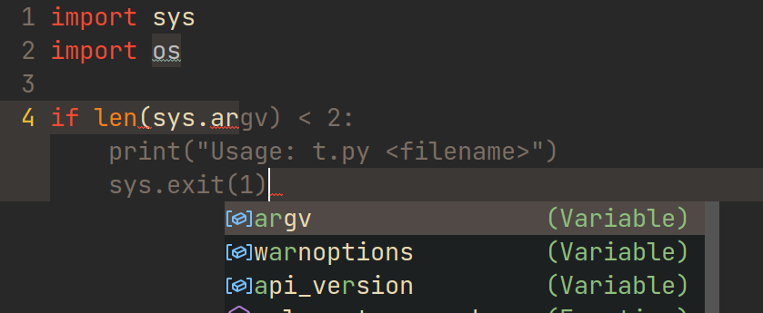
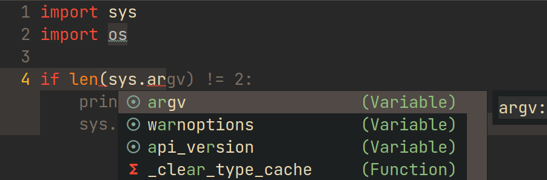

[](https://jcs-emacs.github.io/jcs-elpa/#/copilot)
[](http://melpa.org/#/copilot)
[](http://stable.melpa.org/#/copilot)
[](https://github.com/copilot-emacs/copilot.el/actions/workflows/test.yml)
[](https://github.com/sponsors/bbatsov)

# Copilot.el

Copilot.el is an Emacs plugin for [GitHub Copilot][]. It provides inline
completions (ghost text), an interactive chat interface, and Next Edit
Suggestions — all powered by the official [@github/copilot-language-server][].


The plugin talks to the Copilot language server over JSON-RPC, using `jsonrpc.el`
directly rather than going through an LSP client like eglot. This is a
deliberate choice — most of the Copilot protocol is non-standard LSP, and a
single global server is shared across all buffers and projects. See
[doc/design.md](doc/design.md) for the full rationale.

> [!NOTE]
>
> You need access to [GitHub Copilot][] to use this plugin. The service introduced a free tier in early 2025.

## Requirements

`copilot.el` requires Emacs 27+ and the following packages (installed automatically from MELPA):

- `editorconfig`
- `jsonrpc`
- `compat`
- `track-changes`

[@github/copilot-language-server][] ships precompiled native binaries for macOS (Apple Silicon & Intel), Linux (x64 & ARM64), and Windows (x64).  When npm is not available, `copilot-install-server` automatically downloads and installs the native binary, so Node.js is not required.  If you prefer to install via npm, Node.js 22+ is needed.

## Quick Start

```elisp
(use-package copilot
  :ensure t
  :hook (prog-mode . copilot-mode)
  :bind (:map copilot-completion-map
              ("<tab>" . copilot-accept-completion)
              ("TAB" . copilot-accept-completion)
              ("C-<tab>" . copilot-accept-completion-by-word)
              ("C-TAB" . copilot-accept-completion-by-word)
              ("C-n" . copilot-next-completion)
              ("C-p" . copilot-previous-completion)))
```

Then run `M-x copilot-install-server` and `M-x copilot-login`. That's it!

## Installation

### MELPA

The simplest way to install `copilot.el` is from [MELPA](https://melpa.org/#/copilot):

```elisp
(use-package copilot
  :ensure t)
```

Or `M-x package-install RET copilot RET`.

### Emacs 30+ (use-package :vc)

```elisp
(use-package copilot
  :vc (:url "https://github.com/copilot-emacs/copilot.el"
            :rev :newest
            :branch "main"))
```

### Emacs 27-29 (straight / quelpa)

`straight.el`:

```elisp
(use-package copilot
  :straight (:host github :repo "copilot-emacs/copilot.el" :files ("*.el"))
  :ensure t)
```

`quelpa` + `quelpa-use-package`:

```elisp
(use-package copilot
  :quelpa (copilot :fetcher github
                   :repo "copilot-emacs/copilot.el"
                   :branch "main"
                   :files ("*.el")))
```

### Manual

Clone this repository, make sure the dependencies listed in [Requirements](#requirements) are installed, then:

```elisp
(add-to-list 'load-path "/path/to/copilot.el")
(require 'copilot)
```

### Doom Emacs

<details>

Add package definition to `~/.doom.d/packages.el`:

```elisp
(package! copilot
  :recipe (:host github :repo "copilot-emacs/copilot.el" :files ("*.el")))
```

Configure copilot in `~/.doom.d/config.el`:

```elisp
;; accept completion from copilot and fallback to company
(use-package! copilot
  :hook (prog-mode . copilot-mode)
  :bind (:map copilot-completion-map
              ("<tab>" . 'copilot-accept-completion)
              ("TAB" . 'copilot-accept-completion)
              ("C-TAB" . 'copilot-accept-completion-by-word)
              ("C-<tab>" . 'copilot-accept-completion-by-word)))
```

Strongly recommend to enable `childframe` option in `company` module (`(company +childframe)`) to prevent overlay conflict.

If pressing tab to complete sometimes doesn't work you might want to bind completion to another key or try:

```elisp
(after! (evil copilot)
  ;; Define the custom function that either accepts the completion or does the default behavior
  (defun my/copilot-tab-or-default ()
    (interactive)
    (if (and (bound-and-true-p copilot-mode)
             ;; Add any other conditions to check for active copilot suggestions if necessary
             )
        (copilot-accept-completion)
      (evil-insert 1))) ; Default action to insert a tab. Adjust as needed.

  ;; Bind the custom function to <tab> in Evil's insert state
  (evil-define-key 'insert 'global (kbd "<tab>") 'my/copilot-tab-or-default))
```

If you would love to configure indentation here, this is an example config that may work for you:

```elisp
(use-package! copilot
  :hook (prog-mode . copilot-mode)
  :bind (:map copilot-completion-map
              ("<tab>" . 'copilot-accept-completion)
              ("TAB" . 'copilot-accept-completion)
              ("C-TAB" . 'copilot-accept-completion-by-word)
              ("C-<tab>" . 'copilot-accept-completion-by-word)
              ("C-n" . 'copilot-next-completion)
              ("C-p" . 'copilot-previous-completion))

  :config
  (add-to-list 'copilot-indentation-alist '(prog-mode 2))
  (add-to-list 'copilot-indentation-alist '(org-mode 2))
  (add-to-list 'copilot-indentation-alist '(text-mode 2))
  (add-to-list 'copilot-indentation-alist '(clojure-mode 2))
  (add-to-list 'copilot-indentation-alist '(emacs-lisp-mode 2)))
```

</details>

### Spacemacs

<details>

Edit your `~/.spacemacs` to include the GitHub Copilot layer this will setup everything for you:

```elisp
;; ===================
;; dotspacemacs/layers
;; ===================

;; add or uncomment the auto-completion layer
;; add the GitHub Copilot layer
dotspacemacs-configuration-layers
'(
  ...
  auto-completion
  github-copilot
  ...
 )
```
For details about the default bindings please refer to the Spacemacs documentation for the
github-copilot layer.

</details>

After installing the package, run `M-x copilot-install-server` to install the language server, then `M-x copilot-login` to authenticate. You can verify everything works with `M-x copilot-diagnose` (`NotAuthorized` means you don't have a valid subscription).

## Configuration

### Completion trigger

Use `copilot-mode` to automatically provide completions in a buffer:

```elisp
(add-hook 'prog-mode-hook 'copilot-mode)
```

Or enable it globally with `global-copilot-mode`:

```elisp
(global-copilot-mode)
```

To customize when completions trigger, see `copilot-enable-predicates` and `copilot-disable-predicates`. To customize when completions are displayed, see `copilot-enable-display-predicates` and `copilot-disable-display-predicates`.

Alternatively, you can call `copilot-complete` manually and use `copilot-clear-overlay` in `post-command-hook` to dismiss completions.

### Chat

`copilot-chat` opens an interactive chat with GitHub Copilot using the `conversation/*` LSP methods. The chat buffer streams responses in real time and automatically provides the current buffer as context.

```elisp
;; Start a chat (or send a follow-up if one is already open)
M-x copilot-chat

;; Send selected code with an optional prompt
M-x copilot-chat-send-region
```

There are also one-shot task commands that send the active region (or the function at point when no region is active) with a canned prompt, so you don't have to type anything; the answer streams into the chat buffer as usual:

- `copilot-chat-review` — review the code for bugs, risks, and improvements
- `copilot-chat-fix` — fix bugs or problems in the code
- `copilot-chat-doc` — document the code (docstrings and comments)
- `copilot-chat-optimize` — optimize the code for performance and readability
- `copilot-chat-write-tests` — write unit tests for the code

`copilot-chat-task` prompts for the task with completion and dispatches to the same machinery. The prompts live in `copilot-chat-task-prompts` and can be customized (or extended with your own tasks).

Beyond the prose feedback of `copilot-chat-review`, there is also native Copilot Code Review, the same reviewer behind GitHub's code review. `copilot-chat-review-changes` sends the repository's uncommitted changes (staged and unstaged, like a pre-commit review) to the dedicated review service, and `copilot-chat-review-region` does the same for the selected code. Instead of a streamed chat answer, these return structured review comments, rendered in the chat buffer with file, line, an explanation, and a suggested change when there is one. The review runs outside the chat conversation, so it never disturbs one in progress. Note that Copilot Code Review is a separate entitlement; when a subscription doesn't include it, the server's error ("GitHub Copilot Code Review is not enabled.") is shown in the chat buffer.

Key bindings in the `*copilot-chat*` buffer:
- **C-c RET** or **C-c C-c** — send a follow-up message
- **C-c C-k** — cancel streaming, or reset if idle
- **C-c C-i** — insert the code block at point into the source buffer
- **C-c M-w** — copy the code block at point to the kill ring
- **C-c /** — pick and send a slash command (`/explain`, `/fix`, `/tests`, ...)
- **C-c C-f** — attach a file as context for the next message
- **q** — quit the chat window

Attach extra context for the next message with `copilot-chat-add-file-reference` (`C-c C-f`) or `copilot-chat-add-region-reference`; `copilot-chat-clear-references` drops anything pending.

The chat buffer's header line shows at a glance whether Agent or Ask mode is active, which model answers, and in agent mode how many tools are available. Set `copilot-chat-show-status-header` to `nil` to hide it; the setting is read when the chat buffer is created, so it takes effect for new chat buffers.

Chat sessions can be persisted across Emacs restarts. Set `copilot-chat-save-history` to `t` (it is off by default, since transcripts land on disk in plain text) and the whole session is saved after each completed turn, one file per workspace under `copilot-chat-history-directory` (`~/.emacs.d/copilot-chat-history/` by default). `M-x copilot-chat-restore` brings the saved conversation back: the transcript reappears in the chat buffer, and the next message continues it with the full context (the saved turns are replayed to the server when the new conversation starts). `copilot-chat-clear-history` deletes the current workspace's saved history; `copilot-chat-reset` clears only the live session and leaves the file alone.

`copilot-chat-rewrite` rewrites the active region according to a free-form instruction (e.g. "make it iterative"). The rewritten code is shown as a diff-style preview against the region and applied only after you confirm, so nothing is changed behind your back; the region is tracked with markers, so edits elsewhere in the buffer while the request is in flight are fine, while edits to the region itself drop the rewrite. The instruction preamble can be customized via `copilot-chat-rewrite-prompt`, the applied code is re-indented unless `copilot-chat-rewrite-indent` is set to `nil`, and a pending rewrite can be cancelled with `copilot-chat-stop`. Like `copilot-chat-insert-commit-message`, it runs outside the chat panel and never disturbs an ongoing conversation.

`copilot-chat-insert-commit-message` generates a commit message from the staged changes and inserts it at point. It is meant to be called from a commit message buffer (e.g. Magit's `COMMIT_EDITMSG` or any `git-commit` buffer), but works from any buffer inside a git repository. It runs outside the chat panel, so it never disturbs an ongoing conversation; the instruction sent along with the diff can be customized via `copilot-chat-commit-message-prompt`.

Customization:
- **`copilot-chat-model`** — model to use for chat (default `nil`, meaning a default chat model is resolved from the server)
- **`copilot-chat-use-agent-mode`** — let Copilot run tools (shell commands, file edits, reads, etc.) during a chat (default `nil`)
- **`copilot-chat-preview-tool-edits`** — in agent mode, preview file changes in a temporary buffer before you confirm an edit tool (default `t`)
- **`copilot-chat-terminal-timeout`** — seconds before an agent-mode `run_in_terminal` command is killed (default `30`, `nil` to disable)
- **`copilot-chat-ripgrep-program`** — ripgrep executable used for agent-mode workspace search (default `"rg"`)
- **`copilot-chat-auto-approve-tools`** — tool names that skip the confirmation prompt (default `'("get_errors")`)
- **`copilot-chat-save-history`** — save the chat transcript to disk after each turn, for `copilot-chat-restore` (default `nil`)
- **`copilot-chat-history-directory`** — where saved transcripts live, one file per workspace (default `~/.emacs.d/copilot-chat-history/`)

At each tool confirmation prompt you can answer `yes`, `no`, or `always`; `always` approves that tool for the rest of the conversation so it stops asking.

> [!IMPORTANT]
>
> Agent mode only works with a model that can call tools. Some chat models (and whatever default the server resolves when `copilot-chat-model` is `nil`) can't, and then Copilot just describes the commands to run instead of running them, so agent mode looks inactive. Pick a tool-capable model with `M-x copilot-chat-select-model`. copilot.el also warns when it starts an agent-mode conversation whose model lacks tool support.

> [!TIP]
>
> Install [`markdown-mode`](https://github.com/jrblevin/markdown-mode) for rich markdown rendering (headings, code blocks, emphasis, etc.) in the chat buffer. Without it, only basic highlighting is used.

#### MCP servers

When agent mode is enabled, you can extend Copilot with [Model Context Protocol](https://modelcontextprotocol.io) servers. Set `copilot-mcp-servers` to a map of server name to definition and copilot.el forwards it to the language server, whose tools then become available in the chat. Each invocation still prompts for confirmation unless listed in `copilot-chat-auto-approve-tools`.

```elisp
(setopt copilot-mcp-servers
        '(:fetch (:command "uvx" :args ["mcp-server-fetch"])
          :memory (:command "npx"
                   :args ["-y" "@modelcontextprotocol/server-memory"])
          :remote (:type "http" :url "https://example.com/mcp/"
                   :headers (:Authorization "Bearer TOKEN"))))
```

A server with a `:command` is launched locally over stdio; one with a `:type` of `"http"` or `"sse"` is reached at its `:url`. The value is serialized to JSON, so list-valued fields like `:args` must be vectors. Use `setopt` (or `customize`) so a running server picks up the change.

Run `M-x copilot-chat-list-mcp-tools` to see the connected servers, their status, and the tools they expose. A server that fails to start is reported as a warning.

#### Workspace search

In agent mode, Copilot can search the project: copilot.el answers the server's file-glob, text-search, file-read, and directory-list requests using [ripgrep](https://github.com/BurntSushi/ripgrep) (so `.gitignore` is honored). Make sure `rg` is on your `PATH`, or point `copilot-chat-ripgrep-program` at it.

Set `copilot-chat-enable-semantic-search` to `t` to also let the server build a semantic index of the workspace, for whole-codebase ("@workspace"-style) questions. Indexing computes embeddings server-side, so it uses CPU and network; it is off by default and takes effect when the server next starts.

#### Cloud coding agent

When a conversation gets delegated to GitHub's cloud coding agent (the server-side agent that continues work in a pull request), the server reports its progress to the editor. copilot.el echoes each update and records it, with the PR link, in the `*copilot-coding-agent*` buffer.

#### Custom instructions

The language server reads repository instruction files on its own and applies them to chat and agent requests; copilot.el sends the workspace folders, so this works out of the box. The recognized files (same as in VS Code):

- `.github/copilot-instructions.md` — project-wide instructions, always applied
- `AGENTS.md` — applied always, including nested `AGENTS.md` files in subdirectories
- `CLAUDE.md` / `CLAUDE.local.md` — also honored, if you share a repo with Claude users
- `.github/instructions/*.instructions.md` — scoped instructions with `applyTo` glob front matter
- `.github/git-commit-instructions.md` — used when generating commit messages, including by `copilot-chat-insert-commit-message`

Instruction files are enabled by default. To turn them off, set the corresponding server option through `copilot-lsp-settings`:

```elisp
(setopt copilot-lsp-settings
        '(:github (:copilot (:chat (:codeGeneration (:useInstructionFiles :json-false))))))
```

For a more feature-rich chat experience, take a look at [copilot-chat.el](https://github.com/chep/copilot-chat.el).

> [!WARNING]
>
> `copilot-chat.el` (the chep package) and `copilot.el` both provide an Emacs feature called `copilot-chat`, so they **cannot be installed at the same time**. Having both will cause autoload errors such as "failed to define function copilot-chat-display". If you want to use the chat built into `copilot.el`, make sure `chep/copilot-chat.el` is uninstalled, and vice versa.

### Next Edit Suggestions (NES)

NES predicts the next edit you'll want to make anywhere in the file, based on your recent editing patterns. Unlike inline completions (ghost text at the cursor), NES suggestions can replace or delete existing text at any location.

> [!NOTE]
>
> NES requires `copilot-language-server` version 1.434.0 or newer. Run `M-x copilot-reinstall-server` to upgrade if needed.

`copilot-nes-mode` works alongside `copilot-mode` and relies on it to start and sync the language server. Enable both in the buffer; on its own `copilot-nes-mode` does not produce any suggestions (it will tell you so when enabled without `copilot-mode`).

```elisp
(add-hook 'prog-mode-hook #'copilot-mode)
(add-hook 'prog-mode-hook #'copilot-nes-mode)
```

When a suggestion is pending:
- **TAB** — accept the suggestion (jumps to it first if far away, applies on second press)
- **C-g** — dismiss the suggestion

> [!NOTE]
>
> `copilot-nes-mode` predefines **TAB** and **C-g**, whereas `copilot-mode` ships no completion keybindings and leaves `copilot-completion-map` for you to populate. In both cases the bindings only take effect while a suggestion (or completion) is pending and otherwise fall through to their usual commands, so the predefined NES keys are safe to leave enabled.

Customization variables:
- **`copilot-nes-idle-delay`** — seconds of idle time before requesting a suggestion (default `0.5`)
- **`copilot-nes-auto-dismiss-move-count`** — cursor movements before auto-dismissing (default `3`)
- **`copilot-nes-auto-dismiss-distance`** — max lines between point and suggestion before auto-dismissing (default `40`)

### Keybindings

`copilot-mode` does not set any keybindings by default. Use `copilot-completion-map` (active while a completion overlay is visible) to bind keys:

```elisp
(keymap-set copilot-completion-map "<tab>" #'copilot-accept-completion)
(keymap-set copilot-completion-map "TAB" #'copilot-accept-completion)
(keymap-set copilot-completion-map "C-<tab>" #'copilot-accept-completion-by-word)
(keymap-set copilot-completion-map "C-TAB" #'copilot-accept-completion-by-word)
(keymap-set copilot-completion-map "M-n" #'copilot-next-completion)
(keymap-set copilot-completion-map "M-p" #'copilot-previous-completion)
```

#### Fish-style keybindings

If you use `company-mode` or `corfu`, TAB is already taken. An alternative inspired by Fish shell avoids the conflict entirely — right-arrow accepts, and forward-word/end-of-line accept partially:

```elisp
(keymap-set copilot-completion-map "<right>" #'copilot-accept-completion)
(keymap-set copilot-completion-map "C-f" #'copilot-accept-completion)
(keymap-set copilot-completion-map "M-<right>" #'copilot-accept-completion-by-word)
(keymap-set copilot-completion-map "M-f" #'copilot-accept-completion-by-word)
(keymap-set copilot-completion-map "C-e" #'copilot-accept-completion-by-line)
(keymap-set copilot-completion-map "<end>" #'copilot-accept-completion-by-line)
(keymap-set copilot-completion-map "M-n" #'copilot-next-completion)
(keymap-set copilot-completion-map "M-p" #'copilot-previous-completion)
```

#### Zap-style partial acceptance

To remap the built-in zap commands automatically whenever the overlay is visible:

```elisp
(keymap-set copilot-completion-map "<remap> <zap-to-char>" #'copilot-accept-completion-to-char)
(keymap-set copilot-completion-map "<remap> <zap-up-to-char>" #'copilot-accept-completion-up-to-char)
```

### LSP settings

You can configure the underlying LSP settings via `copilot-lsp-settings`. The complete list of available options can be found
[here](https://github.com/github/copilot-language-server-release?tab=readme-ov-file#configuration-management).

Here we set the GitHub Enterprise server to `https://example2.ghe.com`, exchange the URL with your own server.

```elisp
(setopt copilot-lsp-settings '(:github-enterprise (:uri "https://example2.ghe.com"))) ;; allows changing the value without restarting the LSP
(setq copilot-lsp-settings '(:github-enterprise (:uri "https://example2.ghe.com"))) ;; alternatively
```

You have to restart the LSP (`M-x copilot-diagnose`) when using `setq` to change the value. When logging in, the URL for the authentication flow should be the same as the one set in `copilot-lsp-settings`.

### Language detection

Copilot.el detects the programming language of a buffer based on the major-mode
name, stripping the `-mode` part. The resulting languageId should match the table
[here](https://code.visualstudio.com/docs/languages/identifiers#_known-language-identifiers).
You can add unusual major-mode mappings to `copilot-major-mode-alist`. Without
the proper language set suggestions may be of poorer quality.

```elisp
(add-to-list 'copilot-major-mode-alist '("enh-ruby" . "ruby"))
```

### Network proxy

Format: `'(:host "127.0.0.1" :port 7890 :username "user" :password "password")`, where `:username` and `:password` are optional.

For example:

```elisp
(setq copilot-network-proxy '(:host "127.0.0.1" :port 7890))
```

### Handling server messages

`copilot-on-request` registers a handler for incoming JSON-RPC requests from the language server. Return a JSON-serializable value as the result, or call `jsonrpc-error` for errors. [Read more](https://www.gnu.org/software/emacs/manual/html_node/elisp/JSONRPC-Overview.html).

```elisp
;; Display desktop notification if Emacs is built with D-Bus
(copilot-on-request
 'window/showMessageRequest
 (lambda (msg) (notifications-notify :title "Emacs Copilot" :body (plist-get msg :message))))
```

`copilot-on-notification` registers a listener for incoming LSP notifications.

```elisp
(copilot-on-notification
  'window/logMessage
  (lambda (msg) (message (plist-get msg :message))))
```

## The Copilot Menu

`M-x copilot-menu` opens a transient menu (in the style of Magit) that puts the
most common commands one keystroke away: completions, chat, agent mode, account
and usage info, and server management. It also shows the current state of
`copilot-mode`, agent mode, and the selected chat model, so it doubles as a
quick status overview.

The menu is built on the `transient` package, which is bundled with Emacs 28.1
and newer. It is a soft dependency: on Emacs 27.2 (where current transient
releases are not installable) the rest of copilot.el works as usual and
`copilot-menu` explains what is missing if invoked.

## Commands

> [!TIP]
>
> You don't need to memorize the list — just type `M-x copilot-` followed by TAB, use `M-x copilot-menu`, or use the Copilot menu in the menubar.

| Command | Description |
|---------|-------------|
| `copilot-menu` | Open a transient menu with the most common commands |
| **Setup** | |
| `copilot-install-server` | Install the language server |
| `copilot-uninstall-server` | Remove the installed language server |
| `copilot-reinstall-server` | Re-install the language server |
| `copilot-login` | Log in to GitHub Copilot |
| `copilot-logout` | Log out from GitHub Copilot |
| `copilot-diagnose` | Restart the server and show diagnostic info |
| `copilot-quota` | Show the current Copilot usage quota |
| `copilot-list-code-references` | Show suggestions that matched public code |
| `copilot-select-completion-model` | Choose which model to use for completions |
| `copilot-chat-select-model` | Choose which model to use for chat |
| **Completion** | |
| `copilot-mode` | Toggle automatic completions in the current buffer |
| `copilot-complete` | Trigger a completion at point |
| `copilot-panel-complete` | Show a panel buffer with multiple completion suggestions |
| `copilot-accept-completion` | Accept the current completion |
| `copilot-accept-completion-by-word` | Accept the next N words (prefix arg) |
| `copilot-accept-completion-by-line` | Accept the next N lines (prefix arg) |
| `copilot-accept-completion-by-sentence` | Accept the next N sentences (prefix arg) |
| `copilot-accept-completion-by-paragraph` | Accept the next N paragraphs (prefix arg) |
| `copilot-accept-completion-to-char` | Accept through a character (inclusive, like `zap-to-char`) |
| `copilot-accept-completion-up-to-char` | Accept up to a character (exclusive, like `zap-up-to-char`) |
| `copilot-clear-overlay` | Dismiss the completion overlay |
| **Navigation** | |
| `copilot-next-completion` | Cycle to the next completion |
| `copilot-previous-completion` | Cycle to the previous completion |
| **Chat** | |
| `copilot-chat` | Open Copilot Chat and send a message |
| `copilot-chat-send` | Send a follow-up message in the current chat |
| `copilot-chat-send-region` | Send the selected region as context with an optional prompt |
| `copilot-chat-task` | Pick a one-shot task and run it on the region or defun at point |
| `copilot-chat-review` | Review the region or defun at point |
| `copilot-chat-fix` | Fix the region or defun at point |
| `copilot-chat-doc` | Document the region or defun at point |
| `copilot-chat-optimize` | Optimize the region or defun at point |
| `copilot-chat-write-tests` | Write tests for the region or defun at point |
| `copilot-chat-rewrite` | Rewrite the region per an instruction, with a diff preview and confirmation |
| `copilot-chat-review-changes` | Review the uncommitted changes with native Copilot Code Review |
| `copilot-chat-review-region` | Review the selected code with native Copilot Code Review |
| `copilot-chat-stop` | Cancel streaming, or reset the conversation if idle |
| `copilot-chat-reset` | Destroy the current conversation and clear the chat buffer |
| `copilot-chat-restore` | Restore the saved chat for the current workspace |
| `copilot-chat-clear-history` | Delete the saved chat history for the current workspace |
| `copilot-chat-insert-commit-message` | Generate a commit message for the staged changes and insert it at point |
| **Next Edit Suggestions** | |
| `copilot-nes-mode` | Toggle NES in the current buffer |
| `copilot-nes-accept` | Accept (or jump to) the current NES suggestion |
| `copilot-nes-dismiss` | Dismiss the current NES suggestion |

## Customization

> [!TIP]
>
> Use <kbd>M-x</kbd> `customize-group` <kbd>RET</kbd> `copilot` to browse all available
> configuration options and their documentation.

A few commonly tweaked variables:

- **`copilot-idle-delay`** — Seconds to wait before triggering completion (default `0`). Set to `nil` to disable automatic completion entirely.
- **`copilot-lsp-server-version`** — Pin a specific [@github/copilot-language-server][] version (`nil` means latest).
- **`copilot-enable-predicates`** / **`copilot-disable-predicates`** — Control when `copilot-mode` requests completions.
- **`copilot-enable-display-predicates`** / **`copilot-disable-display-predicates`** — Control when completions are shown.
- **`copilot-clear-overlay-ignore-commands`** — Commands that won't dismiss the overlay.
- **`copilot-indentation-alist`** — Override indentation width per major mode.
- **`copilot-enable-parentheses-balancer`** — Post-process completions to balance parentheses in Lisp modes (default `t`). Set to `nil` to use raw server completions.

## Protocol Support

`copilot.el` communicates with [@github/copilot-language-server][] over JSON-RPC using the LSP protocol plus Copilot-specific extensions. The table below shows the current coverage.

### Client-to-Server Requests

| Method | Status | Notes |
|--------|--------|-------|
| `initialize` | Supported | Sends `rootUri`, `workspaceFolders`, and editor info |
| `shutdown` | Supported | Clean shutdown before exit |
| `textDocument/inlineCompletion` | Supported | Core completion mechanism |
| `workspace/executeCommand` | Supported | Executes server-side commands on accept |
| `signInInitiate` / `signInConfirm` / `checkStatus` / `signOut` | Supported | Authentication flow |
| `copilot/models` | Supported | Lists available completion models |
| `getPanelCompletions` | Supported | Multiple suggestions in a panel buffer |
| `conversation/create` | Supported | Start a new chat conversation |
| `conversation/turn` | Supported | Send a follow-up chat message |
| `conversation/destroy` | Supported | End a chat conversation |
| `copilot/codeReview/reviewChanges` | Supported | Native code review of the uncommitted changes |
| `copilot/codeReview/reviewSnippets` | Supported | Native code review of a selection |
| `textDocument/copilotInlineEdit` | Supported | Next Edit Suggestions (NES) |

### Client-to-Server Notifications

| Method | Status | Notes |
|--------|--------|-------|
| `initialized` | Supported | |
| `exit` | Supported | Sent after `shutdown` |
| `textDocument/didOpen` | Supported | |
| `textDocument/didClose` | Supported | |
| `textDocument/didChange` | Supported | Incremental sync |
| `textDocument/didFocus` | Supported | |
| `textDocument/didShowCompletion` | Supported | Telemetry when overlay is displayed |
| `textDocument/didPartiallyAcceptCompletion` | Supported | Telemetry for partial acceptance |
| `textDocument/didShowInlineEdit` | Supported | Telemetry when NES overlay is displayed |
| `workspace/didChangeConfiguration` | Supported | Sent on settings change |
| `workspace/didChangeWorkspaceFolders` | Supported | Dynamic workspace roots |
| `$/cancelRequest` | Supported | Cancels stale completion requests |
| `textDocument/didSave` | Not yet | |
| `notebookDocument/*` | Not yet | |

### Server-to-Client Requests

| Method | Status | Notes |
|--------|--------|-------|
| `window/showMessageRequest` | Supported | Prompts via `completing-read` |
| `window/showDocument` | Supported | Opens URIs in browser or Emacs |
| `conversation/context` | Supported | Provides editor context for chat |
| `copilot/codingAgentMessage` | Supported | Cloud coding agent updates, logged to `*copilot-coding-agent*` |

### Server-to-Client Notifications

| Method | Status | Notes |
|--------|--------|-------|
| `window/logMessage` | Supported | Logged to `*copilot-language-server-log*` |
| `didChangeStatus` | Supported | Shown in mode-line |
| `$/progress` | Supported | Progress shown in mode-line |
| `PanelSolution` / `PanelSolutionsDone` | Supported | Panel completion results |

Extensible via `copilot-on-request` and `copilot-on-notification` for any messages not handled above.

## Known Issues

### Wrong Position of Other Completion Popups



This is an example of using together with the default frontend of
`company-mode`. Because both `company-mode` and `copilot.el` use overlays to show
completions, the conflict is inevitable. The recommended solution is to use
`company-box` (only available on GUI), which is based on child frames rather than
overlays.

After using `company-box`, you get:



In other editors (e.g. `VS Code`, `PyCharm`), completions from Copilot and other sources cannot show at the same time.
In `copilot.el` they are allowed to coexist, so you can choose the better one at any time.

### Cursor Jumps to End of Line When Typing

If you are using `whitespace-mode`, make sure to remove `newline-mark` from `whitespace-style`.

## FAQ

### Do I need a paid GitHub Copilot subscription?

Not necessarily. GitHub introduced a [free tier](https://github.com/features/copilot#pricing) for Copilot in early 2025 that includes a limited number of completions per month. A paid subscription (Individual or Business) removes these limits.

### TAB doesn't accept the completion

This is usually caused by another package binding TAB in a way that takes
priority. Common culprits include `company-mode`, `corfu`, `yasnippet`, and Evil
mode. A few things to check:

1. **Bind both `<tab>` and `TAB`.** In GUI Emacs these are different events —
   `<tab>` is the function key and `TAB` is the `C-i` character. Some modes only
   intercept one of them. The [Quick Start](#quick-start) example binds both.
2. **Use the fish-style keybindings.** If TAB is hopelessly taken by another
   package, bind acceptance to `<right>` / `C-f` instead. See
   [Fish-style keybindings](#fish-style-keybindings).
3. **Doom Emacs users** — see the [Doom Emacs](#doom-emacs) installation section
   for a workaround using a custom Evil insert-state binding.

### Can I use `copilot-complete` without enabling `copilot-mode`?

Yes. You can call `M-x copilot-complete` manually in any buffer — it will start
the server and open the document automatically. Use `copilot-clear-overlay` (or
simply type) to dismiss the suggestion. This is useful if you prefer on-demand
completions rather than automatic ones.

### Completions are slow or not appearing

A few things to try:

1. **Run `M-x copilot-diagnose`** — it restarts the server and prints diagnostic
   info. Look for `NotAuthorized` (subscription issue) or connection errors.
2. **Check your network** — the language server needs to reach GitHub's API.  If
   you're behind a proxy, configure `copilot-network-proxy`.
3. **Large files** — buffers over `copilot-max-char` characters (default 100 000)
   are skipped. You can raise the limit, but very large files will always be
   slower.
4. **Tune `copilot-idle-delay`** — the default is `0` (immediate). A small delay
   (e.g. `0.2`) reduces server load when typing quickly.

### How do I disable Copilot in certain modes or buffers?

Use `copilot-disable-predicates` to add functions that return `t` when Copilot
should stay quiet:

```elisp
;; Disable in org-mode
(add-to-list 'copilot-disable-predicates
             (lambda () (derived-mode-p 'org-mode)))
```

Or simply don't add `copilot-mode` to the hooks of modes you want to exclude.
If you use `global-copilot-mode`, the predicate approach is the way to go.

### Parentheses are unbalanced in Lisp completions

Copilot.el includes a parentheses balancer that post-processes completions in
Lisp modes (`emacs-lisp-mode`, `clojure-mode`, `scheme-mode`, etc.) to fix
unbalanced delimiters. It is enabled by default. If you still see issues,
make sure `copilot-enable-parentheses-balancer` is `t`, or file a bug report
with the completion text and buffer context.

If the balancer is causing problems for your workflow, you can disable it:

```elisp
(setopt copilot-enable-parentheses-balancer nil)
```

### How do I select a different completion model?

Run `M-x copilot-select-completion-model` to interactively choose from the
models available on your subscription. The selection is saved in
`copilot-completion-model`. Set it to `nil` to revert to the server default.

**Note:** Only models with a "completion" scope are available for inline
completions. Models like Claude, Gemini, and others that you may see in VS
Code's chat UI are chat/edit-only and cannot be used for inline completions.
This is a server-side limitation, not a copilot.el restriction. Currently
GitHub only offers a single completion model (`gpt-41-copilot`).

To select a chat model, run `M-x copilot-chat-select-model`. Many more models
are available for chat (Claude, Gemini, GPT-4o, etc.). The selection is saved
in `copilot-chat-model`. When that is left at `nil`, copilot.el resolves a
default from the server (its designated chat default, or an `auto` model)
rather than leaving the model unset, which some servers answer with an empty
reply.

### Public code references

Copilot can detect when a suggestion closely matches publicly available code.
GitHub calls these matches [code
references](https://docs.github.com/en/copilot/how-tos/get-code-suggestions/find-matching-code)
(or "code referencing"), and copilot.el uses the same term throughout.

> [!NOTE]
>
> "Code references" here are GitHub's public-code matches. They have nothing to
> do with Emacs `xref` (jumping to definitions and finding references to a
> symbol). We follow GitHub's naming so the feature is easy to recognize, but
> the overlap with `xref` is purely a coincidence of vocabulary.

When `copilot-show-code-references` is non-nil (the default), such matches are
announced in the echo area and collected, with their licenses and source URLs,
in a buffer you can open with `M-x copilot-list-code-references`. Set the option
to `nil` to turn the feature off, including the underlying server traffic.

## Reporting Bugs

- Make sure you have restarted your Emacs (and rebuild the plugin if necessary) after updating the plugin.
- Async request errors (e.g. cancelled completions) are logged to `*Messages*` automatically. Check there first for clues.
- For deeper investigation, enable event logging by customizing `copilot-log-max` (to e.g. 1000) and enable debug log `(setq copilot-server-args '("--stdio" "--debug"))`, then paste related logs from the `*copilot events*`, `*copilot stderr*` and `*copilot-language-server-log*` buffers.
- If an exception is thrown, please also paste the stack trace (use `M-x toggle-debug-on-error` to enable stack trace).

## Development

See [doc/design.md](doc/design.md) for an overview of the architecture and key design decisions.

### Running Tests

Unit tests (requires [eask](https://emacs-eask.github.io/)):

```sh
eask test buttercup
```

### Linting

```sh
eask lint checkdoc
eask lint indent
```

### Integration Testing

There's a manual integration test in `dev/integration-smoke.el` that connects to the real Copilot language server and verifies the `textDocument/inlineCompletion` round-trip. It requires the server to be installed and authenticated.

```sh
emacs --batch -L . -l dev/integration-smoke.el
```

## History

copilot.el was started in March 2022. At the time there was no public Copilot
server package — the only way to get one was to extract the Node.js agent
bundled inside [copilot.vim][]. Early versions of copilot.el reverse-engineered
the agent's JSON-RPC protocol from copilot.vim and shipped a copy of that agent
in the repository, updating it whenever a new copilot.vim release appeared.

In early 2025, GitHub published the official
[@github/copilot-language-server][] on npm. copilot.el migrated to this open
server, dropping the copilot.vim dependency entirely. The switch also enabled
newer protocol features like `textDocument/inlineCompletion` (replacing the
legacy `getCompletions`), Copilot Chat, and Next Edit Suggestions.

## Thanks

These projects helped make copilot.el possible:

- [copilot.vim][] — the original reference implementation whose bundled agent powered copilot.el for its first three years
- <https://github.com/TommyX12/company-tabnine/> — inspiration for the overlay-based completion UX
- <https://github.com/cryptobadger/flight-attendant.el>
- [@github/copilot-language-server][]

## Team

Current maintainer: [@bbatsov][].

Retired maintainers: [@zerolfx][], [@emil-vdw][], [@jcs090218][], [@rakotomandimby][].

## Supporting the Development

`copilot.el` is built and maintained by volunteers in their spare time. If you find it useful,
please consider supporting its continued development.

Here are the ways in which you can support the project:

- [GitHub Sponsors](https://github.com/sponsors/bbatsov) (recurring or one-time donations)
- [Patreon](https://www.patreon.com/bbatsov) (recurring donations)
- [PayPal](https://www.paypal.me/bbatsov) (one-time donations)

## License

copilot.el is distributed under the MIT license.

Copyright © 2022-2026 copilot-emacs maintainers and
[contributors](https://github.com/copilot-emacs/copilot.el/contributors).

<!-- Links -->

[@bbatsov]: https://github.com/bbatsov
[@emil-vdw]: https://github.com/emil-vdw
[@jcs090218]: https://github.com/jcs090218
[@rakotomandimby]: https://github.com/rakotomandimby
[@zerolfx]: https://github.com/zerolfx

[GitHub Copilot]: https://github.com/features/copilot
[copilot.vim]: https://github.com/github/copilot.vim
[@github/copilot-language-server]: https://www.npmjs.com/package/@github/copilot-language-server
