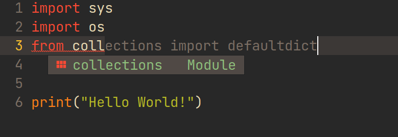
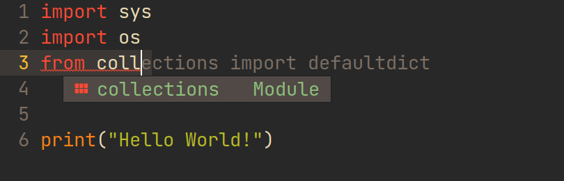

# Copilot.el

Copilot.el is an Emacs plugin for GitHub Copilot.


**Warning:** This plugin is unofficial and based on binaries provided by [copilot.vim](https://github.com/github/copilot.vim).

**Note:** You need access to Copilot technical preview to use this plugin.

## Installation

1. Install [Node.js](https://nodejs.org/en/download/) 12 or newer.

2. Setup `copilot.el` as described in the next section.

3. Login to Copilot by `M-x copilot-login`. You can also check the status by `M-x copilot-diagnose`.

4. Enjoy!

## Configurations

### Example for Doom Emacs 

<details>

Add package definition to `~/.doom.d/packages.el`:

```elisp
(package! copilot
  :recipe (:host github :repo "zerolfx/copilot.el" :files ("*.el" "dist")))
```

Configure copilot in `~/.doom.d/config.el`:

```elisp
;; accept completion from copilot and fallback to company
(defun my-tab ()
  (interactive)
  (or (copilot-accept-completion)
      (company-indent-or-complete-common nil)))

(use-package! copilot
  :hook (prog-mode . copilot-mode)
  :bind (("C-TAB" . 'copilot-accept-completion-by-word)
         ("C-<tab>" . 'copilot-accept-completion-by-word)
         :map company-active-map
         ("<tab>" . 'my-tab)
         ("TAB" . 'my-tab)
         :map company-mode-map
         ("<tab>" . 'my-tab)
         ("TAB" . 'my-tab)))
```

Strongly recommend to enable `childframe` option in `company` module (`(company +childframe)`) to prevent overlay conflict.

</details>

### Example for Spacemacs

<details>

Edit your `~/.spacemacs`:

```elisp
;; ===================
;; dotspacemacs/layers
;; ===================

;; add copilot.el to additional packages
dotspacemacs-additional-packages
 '((copilot :location (recipe
                       :fetcher github
                       :repo "zerolfx/copilot.el"
                       :files ("*.el" "dist"))))

;; ========================
;; dotspacemacs/user-config
;; ========================

;; accept completion from copilot and fallback to company
(defun my-tab ()
  (interactive)
  (or (copilot-accept-completion)
      (company-indent-or-complete-common nil)))

(with-eval-after-load 'company
  ;; disable inline previews
  (delq 'company-preview-if-just-one-frontend company-frontends)
  ;; enable tab completion
  (define-key company-mode-map (kbd "<tab>") 'my-tab)
  (define-key company-mode-map (kbd "TAB") 'my-tab)
  (define-key company-active-map (kbd "<tab>") 'my-tab)
  (define-key company-active-map (kbd "TAB") 'my-tab))


(add-hook 'prog-mode-hook 'copilot-mode)

(define-key evil-insert-state-map (kbd "C-<tab>") 'copilot-accept-completion-by-word)
(define-key evil-insert-state-map (kbd "C-TAB") 'copilot-accept-completion-by-word)
```

</details>

### General Configurations

<details>

#### 1. Load `copilot.el`

##### Option 1: Load via `straight.el` (recommended)


```elisp
(use-package copilot
  :straight (:host github :repo "zerolfx/copilot.el" :files ("dist" "*.el"))
  :ensure t)
;; you can utilize :map :hook and :config to customize copilot
```


##### Option 2: Load manually

Please make sure you have these dependencies installed, and use `load-file` or `load-path` + `require` to load it.

+ `dash`
+ `s`
+ `editorconfig`


#### 2. Configure completion

##### Option 1: Use `copilot-mode` to automatically provide completions

```elisp
(add-hook 'prog-mode-hook 'copilot-mode)
```

To customize the behavior of `copilot-mode`, please check `copilot-enable-predicates` and `copilot-disable-predicates`.

##### Option 2: Manually provide completions

You need to bind `copilot-complete` to some key and call `copilot-clear-overlay` inside `post-command-hook`.


#### 3. Configure completion acceptation

In general, you need to bind `copilot-accept-completion` to some key in order to accept the completion. Also, you may find `copilot-accept-completion-by-word` is useful.

#### Example of using tab with `company-mode`

```elisp
; complete by copilot first, then company-mode
(defun my-tab ()
  (interactive)
  (or (copilot-accept-completion)
      (company-indent-or-complete-common nil)))

; modify company-mode behaviors
(with-eval-after-load 'company
  ;; disable inline previews
  (delq 'company-preview-if-just-one-frontend company-frontends)

  (define-key company-mode-map (kbd "<tab>") 'my-tab)
  (define-key company-mode-map (kbd "TAB") 'my-tab)
  (define-key company-active-map (kbd "<tab>") 'my-tab)
  (define-key company-active-map (kbd "TAB") 'my-tab))
```

#### Example of using tab with `auto-complete`

```elisp
; complete by copilot first, then auto-complete
(defun my-tab ()
  (interactive)
  (or (copilot-accept-completion)
      (ac-expand nil)))

(with-eval-after-load 'auto-complete
  ; disable inline preview
  (setq ac-disable-inline t)
  ; show menu if have only one candidate
  (setq ac-candidate-menu-min 0)

  (define-key ac-completing-map (kbd "TAB") 'my-tab)
  (define-key ac-completing-map (kbd "<tab>") 'my-tab))

(define-key global-map [remap indent-for-tab-command] '(lambda ()
                                                         (interactive)
                                                         (or (copilot-accept-completion)
                                                             (indent-for-tab-command))))
```

</details>

## Commands

#### copilot-diagnose

Check the current status of the plugin. Also you can check error logs in the `*copilot-log*` buffer.

#### copilot-login

Login to GitHub, required for using the plugin.

#### copilot-mode

Enable/disable copilot mode.

#### copilot-complete

Try to complete at the current point.

#### copilot-accept-completion

Accept the current completion.

#### copilot-clear-overlay

Clear copilot overlay in the current buffer.

#### copilot-accept-completion-by-line / copilot-accept-completion-by-word

Similar to `copilot-accept-completion`, but accept the completion by line or word. You can use prefix argument to specify the number of lines or words to accept.

#### copilot-next-completion / copilot-previous-completion

Cycle through the completion list.

## Customization

#### copilot-overlay-safe

Disable to have better visual effect, but may conflict with other plugins using overlay. See known issues for more details. Enabled by default.

#### copilot-idle-delay

Time in seconds to wait before starting completion (default to 0). Note Copilot itself has a ~100ms delay because of network communication.

#### copilot-enable-predicates
A list of predicate functions with no argument to enable Copilot in `copilot-mode`. Copilot will be enabled only if all predicates return `t`.

#### copilot-disable-predicates
A list of predicate functions with no argument to disable Copilot in `copilot-mode`. Copilot will be disabled if any predicate returns `t`.

## Known Issues

### Wrong Cursor Position



Because of the limitation of overlay, the cursor position is wrong when showing completion at the end of lines.
You can try to disable `copilot-overlay-safe` to solve the problem (except when showing completion at the end of buffer), 
but at the cost of introducing conflicts with other plugins (e.g. `visual-line-mode`, `annotate.el`).

After disabling `copilot-overlay-safe`, you have:



### Wrong Position of Other Completion Popups


This is an example of using together with default frontend of `company-mode`. Because both `company-mode` and `copilot.el` use overlay to show completion, so the conflict is inevitable.
To solve the problem, I recommend you to use `company-box` (only available on GUI), which is based on child frame rather than overlay.

After using `company-box`, you have:


In other editors (e.g. `VS Code`, `PyCharm`), completions from copilot and other sources can not show at the same time.
But I decided to allow them to coexist, allowing you to choose a better one at any time.

## Roadmap

+ [x] Setup Copilot without Neovim
+ [x] Cycle through suggestions
+ [x] Add Copilot minor-mode
+ [ ] ~~Add package to MELPA~~

## Thanks

These projects helped me a lot:

+ https://github.com/TommyX12/company-tabnine/
+ https://github.com/cryptobadger/flight-attendant.el
+ https://github.com/github/copilot.vim
